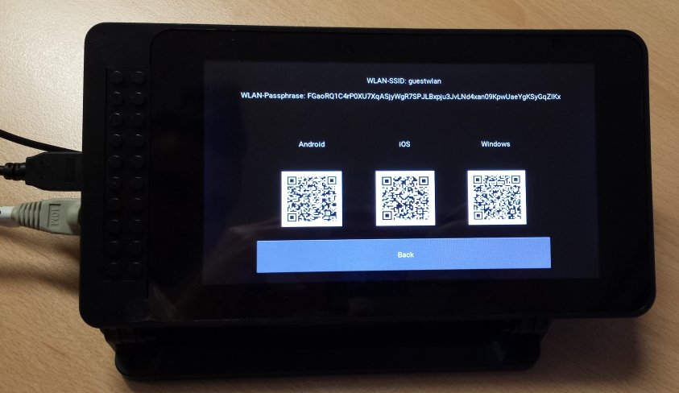
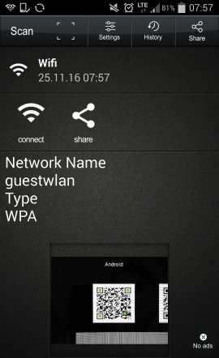

# Guest-WLAN



Easy & Secure Guest WLAN setup with QR code GUI and photodiashow.

Guest-WLAN creates a WLAN access point for your guests with a new, secure
passphrase every day. The WLAN key will be shown on a display along with QR
codes to make it easy for mobile devices to connect. The software also provides
a basic photo diashow function as screensaver.

This project was designed to run on a Raspberry Pi 3 along with the official
touch display on ArchLinux for ARM. Porting it to other distributions or other
hardware should be quite simple.

You can use the QR codes on Android, IOs and Windows phone.



## Installation
Guest-WLAN is designed to run on ArchLinux ARM. Not only because it is a great
distribution with the most up to date packages but also because it is
lightweight and has all dependencies available that are required to run
Guest-WLAN. Other distributions should also work, just install the required
dependencies yourself.

### ArchLinux
You can get the package [guestwlan from AUR](https://aur.archlinux.org/packages/guestwlan/).
Install the package via `makepkg -sri` or if you prefer [build in a clean chroot](https://wiki.archlinux.org/index.php/DeveloperWiki:Building_in_a_Clean_Chroot).
You might also want to install some of the optional dependencies of the package.

### Raspberry Pi
In order to run on the Raspberry Pi and the official display you need to do some
[additional installation steps](https://kivy.org/docs/installation/installation-rpi.html#using-official-rpi-touch-display):
* Config.ini modification for touch display support
* Recompile Kivy on the Raspberry Pi to use its GPU drivers

The config.ini modification is done at runtime in the script itself, so no
further changes are required.

To recompile the kivy software on ArchLinux download its
[PKGBUILD](https://git.archlinux.org/svntogit/community.git/tree/trunk?h=packages/python-kivy)
and run `makepkg -sri` or if you prefer [build in a clean chroot](https://wiki.archlinux.org/index.php/DeveloperWiki:Building_in_a_Clean_Chroot)

**There is currently an issue with the GPU RAM management in kivy.**
You might want to convert you photos to a smaller scale and/or increase the GPU
memory in the Raspberry Pis config. See [this](https://github.com/kivy/kivy/issues/4739)
for further details.

### Manual Installation
You must install the following mandatory dependencies:
* create_ap
* qrencode
* python3
* python-kivy
* python-configobj

The guestwlan.py GUI runs by default with python3 but could also be easily
ported to python2 as Kivy supports python3 and python2.

You also might want to install some additional dependencies:
* haveged: boost low entropy
* rng-tools: boost low entropy
* fakehwclock: Save/restore system clock on machines without RTC
* mtdev: Raspberry Pi touch screen support

You do not need to compile any software as the project only consists of scripts.
You can install all files by running `make install`. Please note that it is not
recommended to install any software directly into the filesystem like this.

## Usage

### Overview
The Guest-WLAN program consist of 3 software parts:
* wlanqrkeygen.sh - Generates new WLAN passphrase and QR codes
* create_guest_ap.service - Creates an access point to connect to
* guestwlan.py - Provides a GUI which displays the QR codes and a photodiashow

### wlanqrkeygen.sh
```
$ sudo wlanqrkeygen --help
Usage: wlanqrkeygen [options]

Generates new WLAN passphrase and QR codes.

Options:
  -h, --help              Show this help
  -c,--config <cfg_file>  Load configs from cfg_file
                          Default: etc/guestwlan/guestwlan.cfg
  -a,--apconfig <ap_conf> Load configs from ap_conf
                          Default: /etc/create_guest_ap.conf
  -l,--length <chars>     Generate a password of a special length
                          Range: 8-63, Default: 63)
  -d,--dict <dict>        Only use characters of a special dict.
                          See 'man tr'. Default: 'alnum'
  -u,--umask <umask>      Use special umask for the QR codes.
                          Default: 0077
  -o,--output <path>      Save QR codes at path.
                          Default: /var/lib/guestwlan

Useful informations:
  * Options are parsed in the priority: params -> config -> default
    This means you can overwrite a config file with input parameters.
  * Using a dict with slashes will cause problems.

Examples:
  wlanqrkeygen -d digit -l 16
  wlanqrkeygen -c ~/guestwlan.cfg -a /etc/create_ap.conf
  wlanqrkeygen -o /var/lib/kodi/ -u 0000
```

##### Files:
```bash
# Configuration
/etc/guestwlan.cfg

# Script and their service
/usr/share/guestwlan/wlanqrkeygen.sh
/usr/bin/wlanqrkeygen (link)
/usr/lib/systemd/system/guestwlan/wlanqrkeygen.service
/usr/lib/systemd/system/guestwlan/wlanqrkeygen.timer

# Default location of the generated QR codes
/var/lib/guestwlan/AndroidWlan.png
/var/lib/guestwlan/WindowsWlan.png
/var/lib/guestwlan/iOSWlan.png
```

### guestwlan.py
guestwlan.py is a python script that provides the GUI for the QR codes and the
photo diashow. Kivy is used for the graphical interface. The program is already
configured to run with the Raspberry Pi touch display.

In order to disable the automatic tty1 screensaver a script is used to disable
it and then start the python program. Python3 is used for this tool while it is
still quite simple to backport to python2 if desired.

All configurations can be made in guestwlan.cfg. The program has no input
parameters yet.

##### Files:
```bash
# Configuration
/etc/guestwlan.cfg

# Script and their service
/usr/share/guestwlan/guestwlan.sh
/usr/share/guestwlan/guestwlan.py
/usr/share/guestwlan/guestwlan.kv
/usr/bin/guestwlan (link)
/usr/lib/systemd/system/guestwlan/guestwlan.service
```

### create_guest_ap
create_guest_ap only provides a service to start an own instance of create_ap.
It creates a WLAN access point and configures all the address translation.
You can configure the access point in `/etc/create_guest_ap.conf`. By default
this config file is readable by root only. See the official create_ap
documentation for more information.

The official `hostapd` package on ArchLinux works out of the box with the
Raspberry Pi 3s WLAN module. If you want to use a USB module you might need to
install a different hostapd driver and also change the config file properly.
Checkout [hostapd-rtl871xdrv](https://aur.archlinux.org/packages/hostapd-rtl871xdrv/)
on AUR.

##### Files:
```bash
# Configuration
/etc/create_guest_ap.conf

# Service
/usr/lib/systemd/system/guestwlan/create_guest_ap.service
```

## Configuration
You can configure every setting in the global config files `/etc/guestwlan.cfg`
and `/etc/create_guest_ap.conf`. See the documentation above for further
details.

```bash
# Start and test wlanqrgen, the access point service and the python GUI
sudo systemctl start wlanqrkeygen.timer
sudo systemctl start create_guest_ap.service
sudo systemctl start guestwlan.service

# Enable the services if everything works fine
sudo systemctl enable wlanqrkeygen.timer
sudo systemctl enable create_guest_ap.service
sudo systemctl enable guestwlan.service

# You can sync other systemd units against guestwlan.target
# Once all of the 3 services have started guestwlan.target is reached.

# Use fake-hwclock on arm devices without RTC
sudo systemctl start fake-hwclock.service
sudo systemctl enable fake-hwclock.service
sudo systemctl start fake-hwclock-save.timer
sudo systemctl enable fake-hwclock-save.timer
```

## Known Issues
* [Not all images are shown on the Raspberry Pi](https://github.com/kivy/kivy/issues/4739)

## TODO
* Tag release + GPG signed tarball
* Fix GPU RAM issue!? [Also reported here](https://github.com/elParaguayo/RPi-InfoScreen-Kivy/issues/68)
* Catch permission denied error in python script
* Test with different hostapd software/USB WLAN
* Add a timeout to go back to screensaver
* Add guestwlan.py input param for different config file
* Disable tty1 screensaver only temporary?
* Provide [more widgets](https://github.com/elParaguayo/RPi-InfoScreen-Kivy)
* tty1 screensaver seems to still trigger sometimes!?
* Catch error when no picture exists
* Show random photo in diashow
* Fix wlanqrgen.service Before= section
* Separate internal network eth0 from external network wlan0
* Option to stop GUI (CTRL + C not functional)
* Test new create_ap implementation

## Links
* [Heise Article](http://www.heise.de/newsticker/meldung/Sicheres-WLAN-mit-dem-Raspberry-Pi-3196682.html)
* [create_ap](https://github.com/oblique/create_ap)
* [RPi-InfoScreen-Kivy](https://www.raspberrypi.org/forums/viewtopic.php?f=41&t=121392)
* https://www.digitalocean.com/community/tutorials/understanding-systemd-units-and-unit-files
* https://wiki.archlinux.org/index.php/Systemd/Timers
* man systemd.timer
* man systemd.time
* man systemd.service
* man systemd.unit

## Version History
```
1.0.1 Release (13.12.2016)
* Added pictures

1.0.0 Release (24.11.2016)
* Initial release of the software
```
